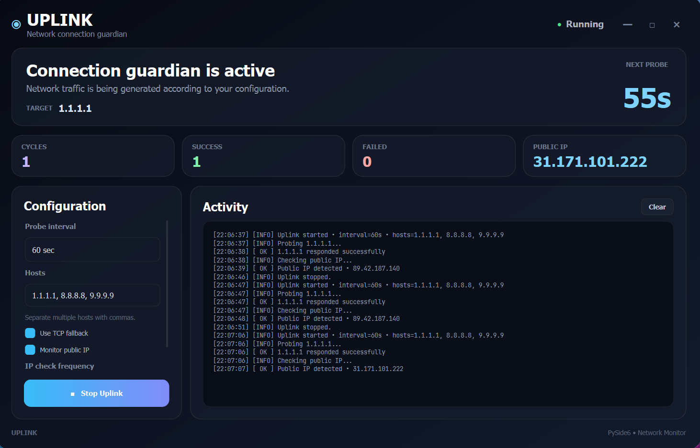

# Uplink



> A lightweight desktop network connection monitor built with Python and PySide6.

Uplink periodically probes configurable network hosts to help keep a connection active and monitor its health. It provides a modern glass-style desktop interface, background network checks, optional TCP fallback, and public IP monitoring.

The goal is simple: **keep an eye on your connection without getting in your way.**

---

## ✨ Features

* 🛰️ **Periodic network probing**

  * Rotate through multiple configurable hosts.
  * Default targets include Cloudflare, Google, and Quad9 DNS servers.

* 🔌 **TCP fallback**

  * If an ICMP ping fails, Uplink can attempt a TCP connection to port `53`.

* 🌐 **Public IP monitoring**

  * Periodically checks your public IP address.
  * Uses multiple fallback services for better reliability.
  * Visually highlights the public IP card when a change is detected.

* 📊 **Live statistics**

  * Total probe cycles
  * Successful probes
  * Failed probes
  * Current public IP

* ⏱️ **Live countdown**

  * Shows the time remaining until the next probe.

* 📝 **Activity log**

  * Real-time event stream with informational, success, warning, and error messages.

* 🖥️ **Responsive interface**

  * Automatically rearranges the layout as the window changes size.
  * Configuration and activity panels adapt to smaller screens.

* 🎨 **Modern dark UI**

  * Frameless window
  * Glass-style cards
  * Gradient controls
  * Subtle shadows
  * Custom window controls

* 🧵 **Non-blocking background worker**

  * Network operations run outside the GUI thread.
  * The interface remains responsive while Uplink is running.

---

## 🚀 Getting Started

### Requirements

* Python **3.10+**
* PySide6
* A system with the `ping` utility available

### Installation

Clone the repository:

```bash
git clone https://github.com/your-username/uplink.git
cd uplink
```

Create a virtual environment:

```bash
python -m venv .venv
```

Activate it.

**Windows:**

```powershell
.venv\Scripts\Activate.ps1
```

**Linux / macOS:**

```bash
source .venv/bin/activate
```

Install dependencies:

```bash
pip install PySide6
```

Run Uplink:

```bash
python main.py
```

---

## ⚙️ Configuration

Uplink currently exposes the following settings through the GUI.

### Probe interval

Controls how often Uplink performs a network probe.

The default is:

```text
60 seconds
```

The interval can be configured from:

```text
5 seconds → 86400 seconds
```

---

### Hosts

Enter one or more hosts separated by commas.

Example:

```text
1.1.1.1, 8.8.8.8, 9.9.9.9
```

Uplink rotates through the configured hosts for each probe cycle.

The default hosts are:

```text
1.1.1.1
8.8.8.8
9.9.9.9
```

---

### TCP fallback

When enabled, Uplink attempts a TCP connection if an ICMP ping fails.

The fallback currently uses:

```text
TCP port 53
```

This provides a second way to determine whether the destination is reachable when ICMP isn't responding.

---

### Public IP monitoring

When enabled, Uplink periodically checks the current public IP address.

The check uses multiple services:

```text
api.ipify.org
ifconfig.me
ipinfo.io
```

If the detected IP changes, Uplink:

1. Updates the public IP display.
2. Highlights the IP card.
3. Adds a warning to the activity log.

---

### IP check frequency

Controls how frequently public IP checks occur relative to probe cycles.

For example:

```text
1 cycle  → check every cycle
5 cycles → check every fifth cycle
10 cycles → check every tenth cycle
```

---

## 🏗️ Project Structure

Uplink is intentionally separated into modules so the project can grow without turning the main window into a giant file.

```text
Uplink/
│
├── main.py
│
├── config.py
├── network.py
├── worker.py
│
├── ui/
│   ├── __init__.py
│   ├── main_window.py
│   ├── styles.py
│   └── widgets.py
│
└── utils/
    ├── __init__.py
    └── logging.py
```

### `main.py`

Application entry point.

Responsible for:

* Creating the `QApplication`
* Configuring the application
* Creating the main window
* Starting the Qt event loop

---

### `config.py`

Contains application configuration and data structures.

Currently includes:

* Application name
* Default hosts
* Public IP services
* `WorkerConfig`

This is also the natural place for future configuration options.

---

### `network.py`

Contains low-level network functionality.

Currently provides:

```python
ping_host()
tcp_probe()
get_public_ip()
```

This module intentionally has no knowledge of the GUI.

---

### `worker.py`

Contains the background keep-alive worker.

The worker:

* Runs network probes
* Rotates hosts
* Performs TCP fallback
* Checks the public IP
* Tracks statistics
* Emits Qt signals for the UI

The worker runs inside a dedicated `QThread` so network operations don't freeze the interface.

---

### `ui/main_window.py`

Contains the main application window and its behavior.

Responsible for:

* Building the interface
* Handling user interaction
* Starting/stopping the worker
* Updating statistics
* Updating the countdown
* Displaying activity logs
* Responsive layout behavior
* Window controls

---

### `ui/widgets.py`

Contains reusable UI helpers.

Currently includes helpers for:

```python
make_label()
make_card()
apply_shadow()
```

As the UI grows, reusable components can be moved here.

---

### `ui/styles.py`

Contains the application's Qt stylesheet.

Keeping the QSS separate makes it much easier to modify the visual design without digging through the window implementation.

---

### `utils/logging.py`

Contains logging infrastructure.

It currently provides a small wrapper around Python's standard logging module and is intended to become the home for more advanced logging functionality as the project grows.

---

## 🔄 How Uplink Works

At a high level, the application follows this flow:

```text
                 ┌──────────────┐
                 │   Uplink UI  │
                 └──────┬───────┘
                        │
                        │ Start
                        ▼
                ┌─────────────────┐
                │ KeepAliveWorker │
                └────────┬────────┘
                         │
                         ▼
                 Select next host
                         │
                         ▼
                    ICMP ping
                         │
                 ┌───────┴───────┐
                 │               │
              Success          Failure
                 │               │
                 │               ▼
                 │          TCP fallback
                 │               │
                 └───────┬───────┘
                         │
                         ▼
                  Update statistics
                         │
                         ▼
                  Optional IP check
                         │
                         ▼
                       Sleep
                         │
                         └──────────► Repeat
```

The worker communicates with the GUI using Qt signals rather than directly manipulating widgets.

---

## 🧵 Threading Model

Uplink uses Qt's worker-thread pattern.

The main GUI runs on the Qt event thread:

```text
Main Thread
    │
    ├── UI
    ├── Buttons
    ├── Statistics
    └── Countdown
```

The network worker runs separately:

```text
Worker Thread
    │
    ├── ICMP probes
    ├── TCP probes
    ├── Public IP checks
    └── Timed wait
```

Communication happens through Qt signals:

```text
Worker
  │
  ├── log
  ├── status
  ├── cycle_finished
  ├── ip_updated
  ├── ip_changed
  └── finished
        │
        ▼
    MainWindow
```

This keeps potentially slow network operations away from the GUI thread.

---

## 🛠️ Development

For development, create a virtual environment and install the project's dependencies:

```bash
python -m venv .venv
```

Activate it and install PySide6:

```bash
pip install PySide6
```

Then launch:

```bash
python main.py
```

### Recommended development workflow

Keep responsibilities separated:

```text
Network functionality
        ↓
    network.py

Background behavior
        ↓
     worker.py

Application settings
        ↓
     config.py

UI behavior
        ↓
ui/main_window.py

Reusable UI components
        ↓
  ui/widgets.py

Visual styling
        ↓
  ui/styles.py
```

This makes it possible to add functionality without coupling unrelated parts of the application.

---


## ⚠️ Notes

Uplink relies on the operating system's `ping` command for ICMP probing.

ICMP traffic may be blocked by:

* Firewalls
* Routers
* ISPs
* VPNs
* Destination networks

A failed ping therefore does not necessarily mean that the internet connection itself is unavailable. The optional TCP fallback provides an additional reachability check.

Public IP detection also depends on external services being reachable.

---

## 🔐 Privacy

Uplink does not require an account or send application telemetry.

When **Public IP Monitoring** is enabled, Uplink contacts the configured public IP detection services to determine the current public-facing IP address.

Those requests are made directly from the machine running Uplink.

---

## 📄 License

Uplink is licensed under the [MIT License](LICENSE).

Copyright (c) 2026 Amirhossein Imani.

You are free to use, copy, modify, merge, publish, distribute, sublicense, and sell copies of the software, subject to the terms of the MIT License.

---

## 🤝 Contributing

Contributions, ideas, bug reports, and feature requests are welcome.

Before submitting a change, try to keep the existing separation of responsibilities intact.

In particular:

* Keep network operations in `network.py`.
* Keep background processing in `worker.py`.
* Keep UI behavior in `ui/main_window.py`.
* Keep reusable UI components in `ui/widgets.py`.
* Keep styling in `ui/styles.py`.
* Avoid putting application logic directly into `main.py`.

Small, focused changes are easier to review and maintain.

---

## ⭐ About Uplink

Uplink started as a small command-line keep-alive utility and evolved into a desktop network monitoring application.

The project is intentionally lightweight: no large framework, no cloud backend, and no complicated service architecture.

Just Python, Qt, and a little networking.

**Keep the connection alive. Keep an eye on it.**
